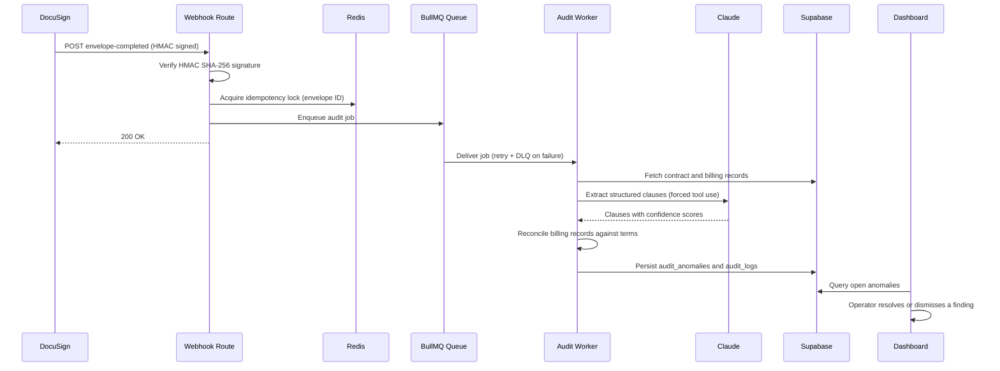

# Contract Revenue Audit Engine

Autonomous contract-to-revenue audit pipeline that detects revenue leakage by reconciling billing records against signed contract terms. Contract clauses are extracted with Claude, reconciliation runs in an isolated background worker, and flagged discrepancies surface in an executive review dashboard.

## Why this exists

Sales and legal teams negotiate volume discounts, SLA penalty credits, and custom pricing terms into contracts, but billing systems don't always apply them correctly. This project is a reference implementation of a pipeline that watches for newly signed contracts, extracts their structured terms with an LLM, and continuously checks historical billing data against those terms to surface unapplied discounts and missing SLA penalty credits before they become permanent revenue loss.

## Architecture

- **Ingestion** — `app/api/webhooks/docusign/route.ts` receives DocuSign envelope-completed webhooks, verifies the HMAC SHA-256 signature, uses Redis for idempotency locking, and enqueues a job onto a BullMQ queue with retry and dead-letter-queue handling.
- **Worker** — `src/workers/auditWorker.ts` runs as a separate Node.js process, never inside the web server's request path. It asks Claude to extract structured clauses from contract text via forced tool use, validates the output with Zod, then reconciles billing records against the extracted terms to compute revenue leakage.
- **Database** — `supabase/schema.sql` defines a multi-tenant Postgres schema with Row-Level Security policies that scope every table to `organization_id`, matching the `organization_id` claim on the authenticated user's JWT.
- **Dashboard** — `app/(dashboard)/anomalies` is a Next.js App Router page that lists flagged anomalies with multi-attribute filtering, resolve/dismiss Server Actions, and an evidence confidence heatmap sourced from Claude's extraction output.
- **Observability** — Sentry is initialized on the client (`sentry.client.config.ts`) and captured from the anomalies route's error boundary.

## Tech stack

Next.js 14 (App Router, Server Actions, TypeScript strict mode), Supabase (Postgres + Row-Level Security), Redis + BullMQ, `@anthropic-ai/sdk` (Claude 3.7 Sonnet), Zod, Tailwind CSS, Sentry, Resend, Docker Compose, and Coolify for deployment.

## Request-to-resolution flow



## Getting started

### Prerequisites

Node.js 20+, a Supabase project, a Redis instance, and an Anthropic API key.

### Environment variables

Copy `.env.example` to `.env.local` and fill in real values. Every variable is documented inline; none of the values checked into `.env.example` are real credentials.

### Local development

```sh
npm install
npm run dev      # Next.js app on http://localhost:3000
npm run worker   # BullMQ audit worker, in a separate terminal
```

### Running tests

```sh
npm run test        # Vitest unit suite
npm run typecheck   # tsc --noEmit
npm run lint        # ESLint
```

### Docker Compose

```sh
docker compose up --build
```

This starts the Next.js app, the standalone worker, and a persistent `redis:7-alpine` instance with append-only-file persistence enabled and health checks on all three services.

## Deployment

The CI/CD pipeline (`.github/workflows/ci-cd.yml`) lints, type-checks, runs the Vitest suite, builds the Next.js app, and then triggers a Coolify deployment webhook when a commit lands on `main` and `COOLIFY_DEPLOY_WEBHOOK_URL` is configured as a repository secret. Coolify builds the two Docker images defined here, `Dockerfile` for the web app and `Dockerfile.worker` for the background worker, using `docker-compose.yml` as the multi-service definition.

## Known simplifications

This repository does not include a full authentication or session-management UI. The dashboard resolves its active tenant from a `DEMO_ORGANIZATION_ID` constant (`src/lib/constants.ts`) rather than a real session JWT claim. Every data-access query is still scoped by `organization_id`, and the database-level Row-Level Security policies in `supabase/schema.sql` are fully implemented, so swapping in real authentication is a matter of replacing that one constant with the session's claim.
